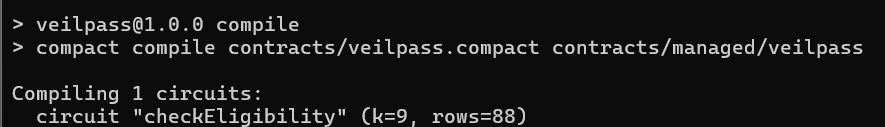
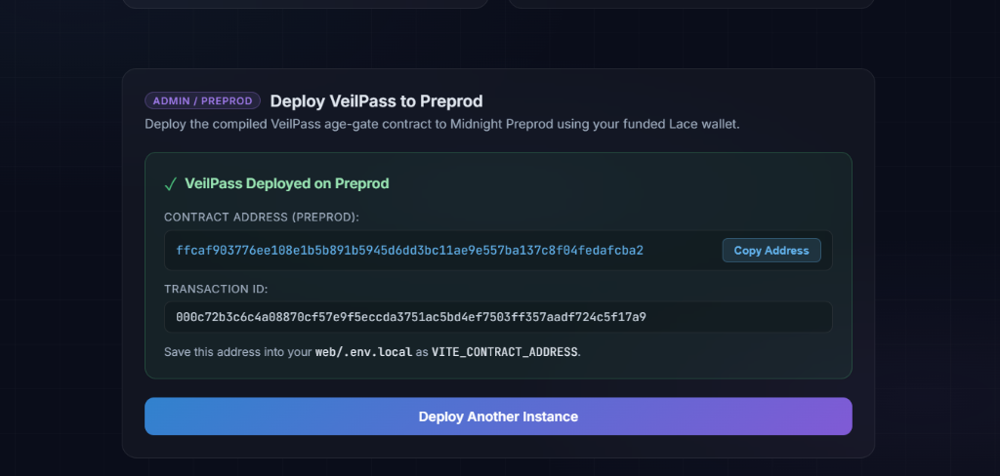
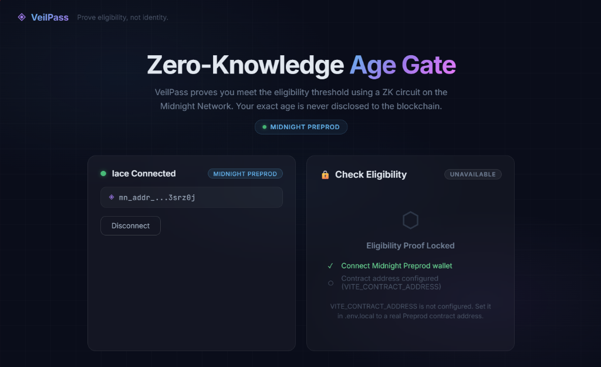
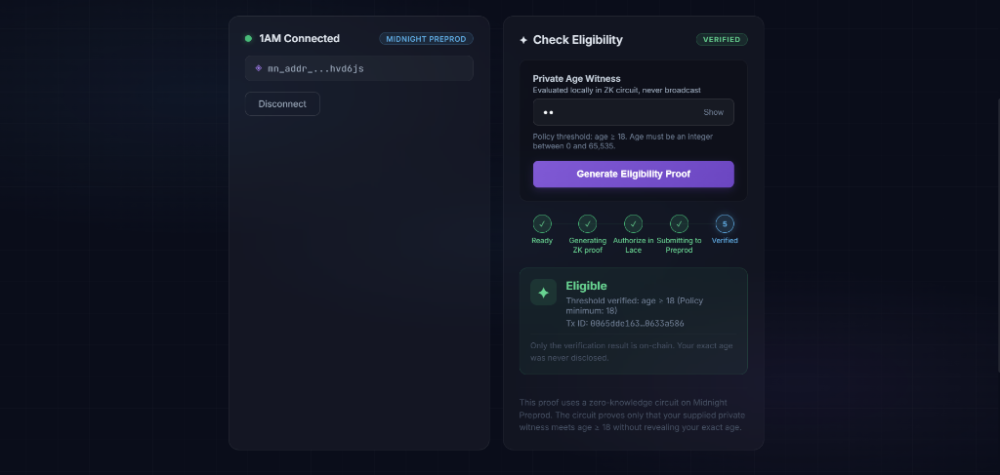
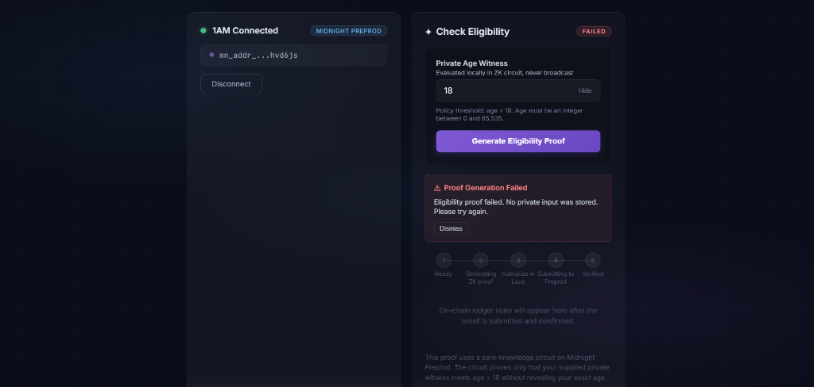
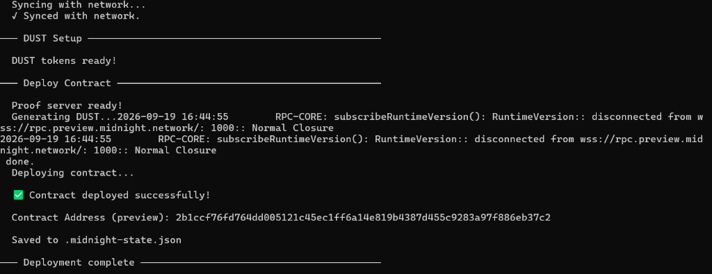

# VeilPass

[](https://github.com/subhadip890/veilpass/actions/workflows/ci.yml)

> Prove eligibility, not identity.

VeilPass is a privacy-preserving zero-knowledge eligibility verification system built on the Midnight Network. It enables users to prove they satisfy an age or policy requirement (such as age &ge; 18) without disclosing their exact age, date of birth, or identity to the verifier or on the public blockchain.

---

## Canonical Deployments

| Network | Status | Contract Address | Deployment Transaction ID |
|---|---|---|---|
| **Local Devnet** (`undeployed`) | **Deployed (Local)** | `74f727d9dca0d28ef6b30953a250b061ad6da95859b0c4826b4a3fc06702a3c6` | — |
| **Preview** (`preview`) | **Deployed** | `2b1ccf76fd764dd005121c45ec1ff6a14e819b4387d455c9283a97f886eb37c2` | — |
| **Preprod** (`preprod`) | **Deployed (Canonical)** | `ffcaf903776ee108e1b5b891b5945d6dd3bc11ae9e557ba137c8f04fedafcba2` | `000c72b3c6c4a08870cf57e9f5eccda3751ac5bd4ef7503ff357aadf724c5f17a9` |

---

## Level 2 Interactive DApp

### Live Application
- **Live DApp URL**: [https://veilpass-ashy.vercel.app/](https://veilpass-ashy.vercel.app/)
- **GitHub Repository**: [https://github.com/subhadip890/veilpass.git](https://github.com/subhadip890/veilpass.git)
- **Target Network**: Midnight Preprod
- **Canonical Contract Address**: `ffcaf903776ee108e1b5b891b5945d6dd3bc11ae9e557ba137c8f04fedafcba2`
- **Deployment Transaction ID**: `000c72b3c6c4a08870cf57e9f5eccda3751ac5bd4ef7503ff357aadf724c5f17a9`
- **Implementation Commit**: `9a34001`

### What the Level 2 DApp Does
The frontend provides a real-time, interactive zero-knowledge proof flow on Midnight Preprod:
1. **Wallet Connection**: Automatically discovers and connects to Midnight-compatible browser wallets (e.g. Lace on Midnight Preprod).
2. **Contract Joining**: Joins the canonical deployed VeilPass contract at `ffcaf903776ee108e1b5b891b5945d6dd3bc11ae9e557ba137c8f04fedafcba2` using `findDeployedContract`.
3. **Ephemeral Private Witness**: Accepts the user's age as an off-chain private witness, held exclusively in an ephemeral reference during proof generation.
4. **Local ZK Proving**: Uses the user's local proof server to compile the witness and generate a genuine ZK proof for the `checkEligibility` circuit.
5. **Circuit Invocation**: Executes `deployed.callTx.checkEligibility(18n)` against the contract's immutable policy threshold of 18.
6. **Preprod Submission**: Balances and submits the proven transaction via the connected wallet to the Midnight Preprod network.
7. **Ledger Confirmation**: Queries the indexer for the confirmed on-chain ledger state (`eligible`, `threshold_used`, `policy_threshold`) and displays the verified result alongside the genuine transaction ID.

> [!NOTE]
> **Important Identity Distinction**: Self-attested age proves mathematically that the supplied private integer satisfies `age >= threshold >= 18`. It does not verify real-world legal identity or birth date without an accredited issuer credential (the Level 3 vision).

---

### Running the Frontend Locally

Follow these steps to run the complete VeilPass stack and frontend on your local machine:

#### 1. Install Dependencies
```bash
# Clone the repository
git clone https://github.com/subhadip890/veilpass.git
cd veilpass

# Install root dependencies
npm install

# Install web application dependencies
cd web && npm install && cd ..
```

#### 2. Start and Verify the Local Proof Server
The Midnight zero-knowledge prover runs locally in Docker:
```bash
# Start the local proof server container
npm run proof-server:start

# Verify the proof server is healthy (HTTP 200)
curl -i http://localhost:6300
```

#### 3. Configure Local Environment
Create `web/.env.local` based on `web/.env.example`:
```bash
cp web/.env.example web/.env.local
```

Configure `web/.env.local` with the canonical Preprod values:
```env
VITE_NETWORK_ID=preprod
VITE_CONTRACT_ADDRESS=ffcaf903776ee108e1b5b891b5945d6dd3bc11ae9e557ba137c8f04fedafcba2
VITE_PROOF_SERVER_URL=http://localhost:6300
VITE_ENABLE_DEPLOY_PANEL=false
VITE_INDEXER_URL=https://indexer.preprod.midnight.network/api/v4/graphql
VITE_INDEXER_WS_URL=wss://indexer.preprod.midnight.network/api/v4/graphql/ws
```

> [!WARNING]
> `web/.env.local` is strictly gitignored and must never be committed to source control.

#### 4. Run the Development Server
```bash
npm run dev
```
Open `http://localhost:5173` in your browser. Ensure your Midnight-compatible wallet is connected to **Midnight Preprod**.

#### 5. Build, Lint, and Test
```bash
# Typecheck TypeScript
npm run build

# Run contract test suite (8 tests)
npm test

# Build production web bundle
npm run build:web

# Run web test suite (77 tests)
npm run test:web

# Run ESLint
npm run lint
```

---

### Live-Site Proof-Server Requirement

The production web application is hosted on Vercel at [https://veilpass-ashy.vercel.app/](https://veilpass-ashy.vercel.app/).

To generate zero-knowledge proofs on the live DApp:
- **Local Proof Server Required**: A user-controlled local proof server must be running at `http://localhost:6300` on the same machine used to access the browser.
- **Architectural Rationale**: In zero-knowledge architecture, private witness data (such as your private age) must **never** be transmitted to an uncontrolled remote third-party server. By requiring a local proof server container (`docker compose up -d`), all cryptographic proving occurs strictly on your machine, preserving self-sovereign privacy.
- **Starting the Prover**: Run `docker compose up -d proof-server` or `npm run proof-server:start` before clicking **Generate Eligibility Proof**.

---

### Privacy Lifecycle

VeilPass enforces strict zero-knowledge privacy guarantees throughout the entire user journey:

```
[User Input] ──> [Component State] ──(submit)──> [Ephemeral Ref] ──> [Local Proof Server]
                       │                                                    │
                 (wiped on submit)                               (ZK proof generated locally)
                                                                            │
[Result Display] <── [Confirmed On-Chain] <── [Preprod Submission] <────────┘
 (Eligible / Tx ID)     (No Age On-Chain)      (Zero-Knowledge Proof)
```

1. **Input Stage**: The private age input is held temporarily in React component state. Password masking is enabled by default to prevent shoulder surfing.
2. **Submission**: The input field is immediately wiped when submission begins.
3. **Proof Generation**: The private witness value is stored exclusively in an ephemeral React reference (`ephemeralAgeRef`) for the duration of circuit evaluation.
4. **Cleanup Guarantee**: The ephemeral witness is strictly cleared in a `finally` block and during unmount cleanup. It is **never** saved to `localStorage`, `sessionStorage`, cookies, URL parameters, console logs, or network payloads.
5. **Public Disclosure**: Only the circuit result (`eligible: true`), public policy threshold (`18`), and transaction ID appear in the confirmed state. The user's exact age is never on-chain.
6. **Local Underage Rejection**: If the user enters an age below 18, the Compact circuit assertion fails locally before transaction construction. **No transaction is submitted to the network**, no transaction fees are spent, and no synthetic ledger state is created. The UI explicitly states: *"Rejected locally by the eligibility circuit — no transaction was submitted."*

---

### Verified Preprod Evidence

| Parameter | Verified Value |
|---|---|
| **Network** | Midnight Preprod |
| **Contract Address** | `ffcaf903776ee108e1b5b891b5945d6dd3bc11ae9e557ba137c8f04fedafcba2` |
| **Deployment Transaction ID** | `000c72b3c6c4a08870cf57e9f5eccda3751ac5bd4ef7503ff357aadf724c5f17a9` |
| **Live Application** | [https://veilpass-ashy.vercel.app/](https://veilpass-ashy.vercel.app/) |
| **Implementation Commit** | `9a34001` |
| **Eligibility Proof Transaction ID** | `007ef8790fd8729f3214c9c575e9fb5e2b7c6a07195d6771d504dae9aea53359da` |

For screenshot evidence capture instructions, see [`docs/LEVEL_2_EVIDENCE_CHECKLIST.md`](docs/LEVEL_2_EVIDENCE_CHECKLIST.md).
For the complete Level 2 submission package and details, see [`docs/LEVEL_2_SUBMISSION.md`](docs/LEVEL_2_SUBMISSION.md).

---

## What This Does (Architecture & Cryptography)

In traditional systems, proving eligibility—such as verifying that a user is over 18 or 21—requires handing over physical IDs, passports, or exact dates of birth, creating centralized databases vulnerable to leaks and identity theft.

VeilPass solves this by using zero-knowledge (ZK) proofs. A user proves locally that their private age satisfies a required threshold. The smart contract validates this mathematical proof on-chain and records eligibility without the user ever revealing their actual age, birth date, or identity to the verifier or the public blockchain.

## Privacy Model

VeilPass demonstrates zero-knowledge selective disclosure on Midnight:

### Public Ledger State (On-Chain)
- `policy_threshold`: `Uint<16>` set to `18` by the constructor. Enforces the contract's immutable minimum age requirement so no caller can lower the threshold.
- `eligible`: `Boolean` (`true` / `false`) indicating that a valid proof was recorded on this shared contract.
- `threshold_used`: `Uint<16>` recording the public threshold evaluated in the proof (must satisfy `threshold >= policy_threshold`).
- On-chain zero-knowledge proof verifying computational correctness without exposing private inputs.

### Private Witness (Client-Side Only)
- `witness privateAge(): Uint<16>`: The user's age is provided off-chain exclusively to the local zero-knowledge proof server. It **never** leaves the user's device, is never transmitted across the network, is never written to the blockchain, and is never logged in console or error outputs.

### What the Circuit Proves Without Revealing
- **Policy Enforcement**: Asserts `threshold >= policy_threshold` (18). A caller cannot bypass the policy by requesting a threshold of 0 or any sub-18 value.
- **Eligibility Compliance**: Asserts `privateAge >= threshold` without disclosing the private age value.
- **Truthful State Update**: Updates `eligible` and `threshold_used` on-chain to reflect the verified proof.
- **Selective Disclosure**: Only `disclose()` is called on the minimal boolean result and the requested threshold. The private age remains completely confidential.

### Level 1 Trust & Architectural Limitations
- **Self-Attested Age Limitation**: In this demonstration, the private age is entered by the user. The ZK circuit proves mathematically that the provided private integer satisfies `age >= threshold`, but does not verify real-world legal identity or birth date without an accredited issuer credential (the Level 3 vision).
- **Global Eligible-State Limitation**: The on-chain `eligible` flag is shared contract-level state. It records that *a* valid proof occurred on this contract; it does **not** authenticate, identify, or certify the individual user or connected wallet viewing the state.
- **Frontend Guidance**: Frontends must never present the contract's global `eligible: true` as proof about the connected wallet, nor use shared contract state as an access-control gate. Frontends should label the state as *"Contract Ledger Status: Valid Proof Recorded On-Chain"* and only display user-specific success within the ephemeral local proof flow.

## Tech Stack

- **Midnight Network**: Privacy-first layer-1 blockchain utilizing zero-knowledge cryptography.
- **Compact**: Domain-specific smart contract language for Midnight circuits and ledger state.
- **Midnight.js (v4.1.1)**: Client SDK for contract deployment, wallet integration, and transaction submission.
- **TypeScript**: Type-safe contract interaction, testing, and CLI tooling.
- **React 18 & Vite**: Fast, modern frontend framework with native WASM and top-level await support.
- **Docker & Proof Server (v8.1.0)**: Local zero-knowledge proof generation container.

## Run Tests

Execute the automated contract test suite:

```bash
npm test
```

The test suite runs against the compiled Compact JavaScript bytecode using `@midnight-ntwrk/compact-runtime` and covers 8 test cases:
1. **Contract Initialization**: Constructor sets `policy_threshold = 18`, `eligible = false`, and `threshold_used = 0`.
2. **Eligible Input**: `age = 25 >= threshold = 18` sets `eligible = true`, `threshold_used = 18`, and `policy_threshold = 18`.
3. **Ineligible Input**: `age = 16 < threshold = 18` triggers circuit assertion failure (`age is below threshold`).
4. **Policy Enforcement (Zero Threshold)**: Caller passing `threshold = 0` is strictly rejected (`threshold cannot be below policy threshold (18)`).
5. **Policy Enforcement (Sub-18 Threshold)**: Underage caller (`age = 17`) attempting to bypass the gate with `threshold = 17` is strictly rejected.
6. **Boundary Condition**: `age === threshold === policy_threshold` (all 18) evaluates as eligible (`eligible = true`).
7. **Configurable Threshold**: Caller proving 21+ (`age = 22 >= threshold = 21 >= policy 18`) succeeds with `threshold_used = 21`.
8. **Privacy Inspection**: Verifies that the private age witness value (`42n`) does not appear in any public ledger field or circuit return value.

## Initial Idea

VeilPass is envisioned as a universal, privacy-preserving age and eligibility gate for modern web applications, restricted online services, age-gated commerce, and decentralized communities. Rather than forcing users to upload sensitive identity documents, scans of passports, or credit cards to prove adulthood, VeilPass allows users to generate zero-knowledge proofs client-side that confirm they satisfy the required age or credential threshold without revealing any personal details. As the project evolves toward Level 3, VeilPass will integrate with decentralized identity (DID) standards and Verifiable Credentials, enabling seamless, privacy-preserving compliance for platforms while eliminating liability and centralized identity honeypots.

## Screenshots

### Successful Compact Compilation



### Successful Preprod Deployment



### Live Application



### Midnight Wallet Connected


### Verified Zero-Knowledge Eligibility Proof



### Local Circuit Underage Rejection



### Successful Preview Deployment



## Security

- **Never Commit Secrets**: Wallet recovery phrases, private seeds, mnemonics, `.midnight-state.json`, and `.midnight-wallet-state/` are strictly gitignored and must never be committed to source control.
- **Private State Encryption**: LevelDB private state is stored in `veilpass-private-state/` (gitignored). On public networks (`preview`/`preprod`), a user-supplied `PRIVATE_STATE_PASSWORD` environment variable (minimum 16 characters) is strictly required and is never logged or printed.
- **Genesis Seed Restriction**: The hardcoded genesis seed in development scripts is restricted exclusively to local devnet (`undeployed`) and must never be used on testnets or mainnet.
